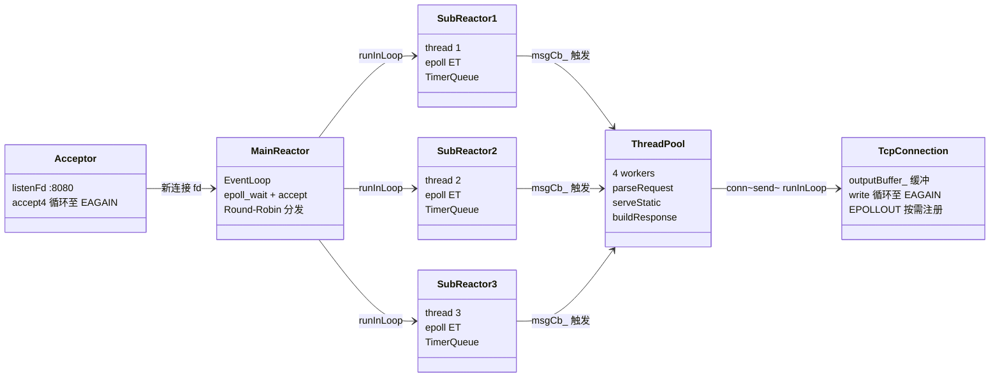
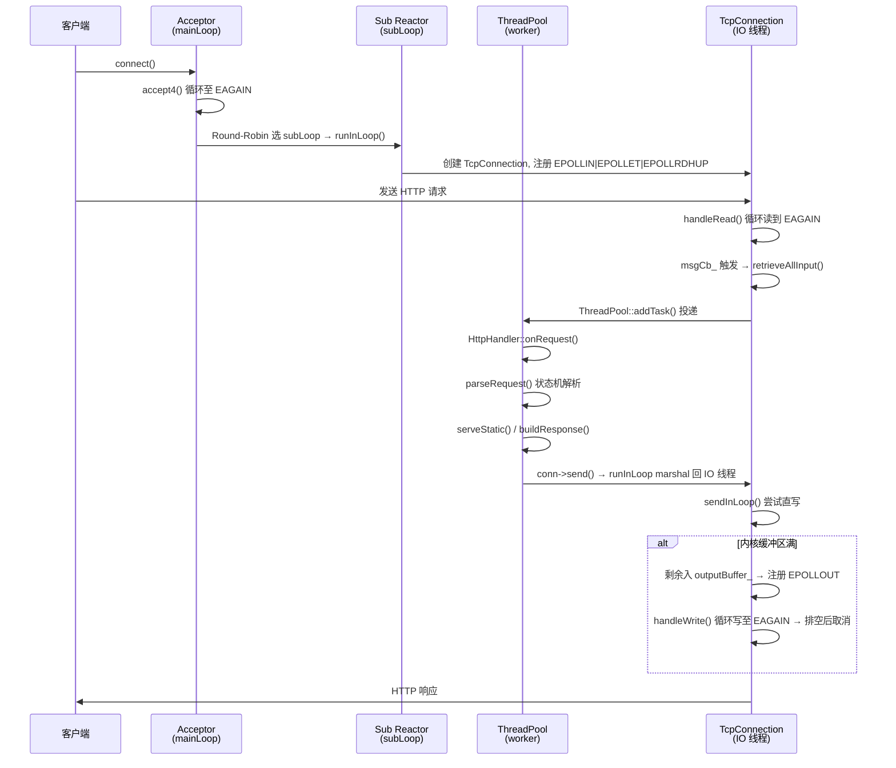

# HTTP Server

基于 C++23 的高性能 HTTP 静态文件服务器，采用 **主从 Reactor + epoll ET + 线程池** 架构，支持可配置的静态文件发送策略（read/write vs mmap），可用于系统学习 Linux 网络编程核心机制。

---

## 目录

- [特性列表](#特性列表)
- [架构设计](#架构设计)
- [模块详解](#模块详解)
- [环境要求](#环境要求)
- [编译构建](#编译构建)
- [运行与配置](#运行与配置)
- [功能验证](#功能验证)
- [单元测试](#单元测试)
- [压力测试](#压力测试)
- [项目结构](#项目结构)
- [核心设计亮点](#核心设计亮点)
- [踩坑记录](#踩坑记录)

---

## 特性列表

| 特性 | 说明 |
|------|------|
| **主从 Reactor** | mainLoop 专职 accept，subLoop 轮询分发，避免单线程瓶颈 |
| **epoll ET 非阻塞** | 循环读至 EAGAIN / 循环写至 EAGAIN，搭配 `SOCK_NONBLOCK` |
| **线程池** | 可配置 worker 数，HTTP 解析与响应在业务线程执行，IO 与计算分离 |
| **HTTP/1.1 状态机解析** | `ParsingRequestLine → ParsingHeaders → ParsingBody → Complete`，防御畸形请求 |
| **Keep-Alive 长连接** | HTTP/1.1 默认 keep-alive，支持 `Connection: close` 半关闭 |
| **空闲超时检测** | 最小堆定时器 + `weak_ptr` 自校验，防 fd 复用误删 |
| **静态文件多策略** | readwrite（基线）/ mmap（内存映射），配置文件一键切换 |
| **配置文件驱动** | `key = value` 格式，支持端口、线程数、超时、日志路径等 |
| **线程安全日志** | 单例 Logger + mutex，精确到毫秒的时间戳 + 线程 ID + 文件行号 |
| **跨线程安全发送** | `send()` / `shutdown()` 通过 `runInLoop` marshal 回 IO 线程 |
| **enable_shared_from_this** | 异步回调中保障 TcpConnection 对象存活 |
| **eventfd 跨线程唤醒** | `queueInLoop` 写 eventfd 唤醒阻塞在 `epoll_wait` 的 Reactor |
| **优雅退出** | SIGINT / SIGTERM 触发 `stop()`，所有 Reactor 线程干净退出 |
| **目录穿越防护** | 检测 `..` 路径，返回 403 Forbidden |
| **MIME 类型推断** | 根据文件扩展名自动映射 Content-Type（13 种常见类型） |

---

## 架构设计

### 整体架构图



### 请求处理全链路



---

## 模块详解

### 网络核心层

| 模块 | 文件 | 职责 |
|------|------|------|
| **EventLoop** | `EventLoop.h/cpp` | epoll 事件循环核心。封装 `epollFd_` + `wakeupFd_`（eventfd），`loop()` 中计算定时器最近到期时间作为 `epoll_wait` 超时参数，循环分发事件后处理过期定时器和 pending 任务。`runInLoop()` / `queueInLoop()` 支持跨线程投递任务 |
| **Channel** | `Channel.h/cpp` | 封装单个 fd + 关注事件掩码 + 四种回调（read/write/close/error）。`enableReading()` 设置 `EPOLLIN | EPOLLRDHUP | EPOLLET`；`handleEvent()` 中 **EPOLLRDHUP/EPOLLHUP 优先处理并 return**，防止 close 后 use-after-free |
| **Acceptor** | `Acceptor.h/cpp` | 封装 listenFd，`SOCK_NONBLOCK \| SOCK_CLOEXEC`，`SO_REUSEADDR`。`handleRead()` 循环 `accept4` 至 EAGAIN，每个新 fd 通过回调上报 |
| **TcpConnection** | `TcpConnection.h/cpp` | 管理单个 TCP 连接的完整生命周期。继承 `enable_shared_from_this`。`handleRead()` ET 循环读至 EAGAIN；`send()` 线程安全入口，跨线程走 `runInLoop`；`sendInLoop()` 先尝试直写，部分写出则入 `outputBuffer_` 并注册 EPOLLOUT；`handleWrite()` 循环写至 EAGAIN，排空后取消 EPOLLOUT |

### HTTP 协议层

| 模块 | 文件 | 职责 |
|------|------|------|
| **HttpRequest** | `HttpRequest.h/cpp` | HTTP 请求状态机。四个状态：`ParsingRequestLine → ParsingHeaders → ParsingBody → Complete`。支持 GET/POST/HEAD/OPTIONS，URL 百分号解码（`%xx`），Header key 统一小写化，`keepAlive()` 按 HTTP 版本判定长连接 |
| **HttpResponse** | `HttpResponse.h/cpp` | HTTP 响应构造。状态码 → 原因短语自动映射（16 种），`serialize()` 序列化为 `HTTP/1.1 code reason\r\nHeaders\r\n\r\nBody`，`mimeFromExt()` 根据扩展名推断 Content-Type |
| **HttpHandler** | `HttpHandler.h/cpp` | 请求路由与响应构建。`onRequest()` 解析 → 路由（GET/HEAD 走 `serveStatic`，POST 回显 body，OPTIONS 返回 Allow）；`serveStatic()` 先 stat 探测文件，header 与 body 分离发送，支持目录穿越检测（`..` → 403） |
| **StaticFileSender** | `StaticFileSender.h/cpp` | 静态文件发送策略实现。**readwrite**：`open → read → conn->send()`；**sendfile**：`sendfile()` 零拷贝循环至全部发出；**mmap**：`mmap → conn->send(std::string) → munmap` |

### 并发与调度层

| 模块 | 文件 | 职责 |
|------|------|------|
| **ThreadPool** | `ThreadPool.h/cpp` | 固定大小线程池。worker 循环 `cv_.wait()` 等待任务，`addTask()` 加锁入队 + `notify_one()`。析构时 `stop_ = true` + `notify_all()`，worker 排空队列后退出 |
| **TimerQueue** | `TimerQueue.h/cpp` | 最小堆定时器队列。`addTimer()` 入堆，`processExpiredTimers()` 弹出所有到期定时器执行回调（先 pop 再执行，避免回调中操作堆导致状态错乱），`nextExpireMs()` 返回距堆顶的剩余毫秒数供 `epoll_wait` 超时 |
| **HttpServer** | `HttpServer.h/cpp` | 顶层入口。构造时创建 mainLoop + acceptor + N 个 subLoop（各在独立线程 `loop()`）+ ThreadPool。`onNewConnection()` Round-Robin 选 subLoop，`runInLoop` 创建 TcpConnection。`scheduleIdleClose()` 用 `weak_ptr` + 身份校验防 fd 复用误删。信号处理器触发 `stop()` → 所有 loop `quit()` |

### 辅助组件

| 模块 | 文件 | 职责 |
|------|------|------|
| **Logger** | `Logger.h/cpp` | 线程安全日志单例（magic static）。四级日志 DEBUG/INFO/WARN/ERROR，`vsnprintf` 两次调用（先测长度再分配），输出格式：`[时间戳] [级别] [tid:xxx] [file:line] message` |
| **Config** | `Config.h/cpp` | `key = value` 配置文件解析。跳过 `#` 注释和空行，`getInt()` / `getString()` 带默认值，非数字值安全兜底 |

---

## 环境要求

| 依赖 | 最低版本 | 说明 |
|------|---------|------|
| **OS** | Linux | 需要 epoll、eventfd、accept4、mmap、sendfile 系统调用 |
| **编译器** | GCC 14+ 或 Clang 18+ | 需支持 C++23（`std::unordered_set::contains` 等） |
| **CMake** | 3.28+ | 构建系统 |
| **压测工具**（可选） | wrk > ab > webbench | `run_bench.sh` 自动探测，都没有则回退 curl |

---

## 编译构建

```bash
cd code/stage08/http-server

# 配置（-B 指定构建目录，导出 compile_commands.json 供 Clangd 使用）
cmake -B build

# 编译
cmake --build build -j$(nproc)
```

编译产物：

| 文件 | 说明 |
|------|------|
| `build/http-server` | 主程序 |
| `build/test_http_parser` | HTTP 解析单元测试 |

---

## 运行与配置

### 启动

```bash
# 回到项目根目录（配置文件使用相对路径）
cd code/stage08/http-server

# 使用默认配置启动
./build/http-server

# Ctrl+C 优雅退出
```

### 配置文件

`conf/server.conf`：

```ini
# 监听端口
port = 8080

# Sub Reactor 线程数（建议 = CPU 核数）
sub_reactor_count = 3

# 业务线程池 worker 数
thread_pool_size = 4

# 静态文件根目录
document_root = ./www

# 日志文件路径（空 = 输出到 stdout）
log_path = ./http-server.log

# 日志级别：DEBUG | INFO | WARN | ERROR
log_level = INFO

# 连接空闲超时（毫秒），超时后自动关闭
connection_timeout_ms = 30000

# 静态文件发送策略：readwrite | mmap
static_file_strategy = readwrite
```

> 配置文件加载失败时自动使用默认值，不会阻止启动。

---

## 功能验证

启动服务器后，另开终端测试：

```bash
# 1. 正常 GET 请求（应返回 200 + HTML 页面）
curl -v http://localhost:8080/index.html

# 2. 默认首页（URI 为 / 自动返回 index.html）
curl -v http://localhost:8080/

# 3. HEAD 请求（返回 header + Content-Length，无 body）
curl -I http://localhost:8080/index.html

# 4. 不存在的文件（应返回 404 + 404.html 内容）
curl -v http://localhost:8080/not_exist.html

# 5. 目录穿越攻击（应返回 403 Forbidden）
curl -v http://localhost:8080/../../../etc/passwd

# 6. POST 请求（回显 body）
curl -X POST -d "hello world" http://localhost:8080/echo

# 7. OPTIONS 请求（返回 Allow 头）
curl -X OPTIONS -v http://localhost:8080/

# 8. 不支持的方法（应返回 405）
curl -X PUT -v http://localhost:8080/

# 9. Keep-Alive 长连接（同一连接发两个请求）
curl -v --keepalive http://localhost:8080/index.html http://localhost:8080/404.html

# 10. 中文 URL 解码
curl -v "http://localhost:8080/%E4%BD%A0%E5%A5%BD"
```

---

## 单元测试

```bash
cd code/stage08/http-server
./build/test_http_parser
```

预期输出：

```
[PASS] testParseRequestLine
[PASS] testUrlDecode
[PASS] testMime
[PASS] testResponseSerialize
[PASS] testKeepAlive

=== all tests passed ===
```

覆盖测试点：
- 请求行解析（method / URI / version）
- URL 百分号解码（含中文 `%E4%BD%A0%E5%A5%BD`）
- MIME 类型推断（html / png / css / js / 未知扩展名）
- 响应序列化（状态行 + Content-Length + 空行 + body）
- Keep-Alive 判定（HTTP/1.1 默认长连接 vs `Connection: close`）

---

## 压力测试

### 自动压测脚本

```bash
# 默认对比 readwrite vs mmap 两种策略
bash bench/run_bench.sh

# 自定义参数
CONNECTIONS=200 DURATION=15 bash bench/run_bench.sh

# 只测基线策略
STRATEGIES="readwrite" bash bench/run_bench.sh

# 额外采集系统调用统计（需安装 strace）
DO_STRACE=1 bash bench/run_bench.sh

# 强制指定压测工具（跳过交互菜单）
TOOL=ab bash bench/run_bench.sh
```

> **压测工具选择**：脚本会探测本机所有可用工具（wrk/ab/webbench/curl）。在交互式终端直接运行且探测到多个时，会列出菜单让你手动选一个；若指定了 `TOOL=` 或处于非交互环境（CI/管道），则按优先级 `wrk > ab > webbench > curl` 自动取第一个可用工具。

### 压测脚本环境变量

| 变量 | 默认值 | 说明 |
|------|-------|------|
| `BIN` | 自动探测 `build/http-server` | 可执行文件路径 |
| `TOOL` | 交互选择或按优先级回退 | 强制指定压测工具（`wrk`/`ab`/`webbench`/`curl`）；不指定时，交互式终端会弹菜单让你选，非交互则按 wrk>ab>webbench>curl 取第一个可用 |
| `STRATEGIES` | `readwrite mmap` | 要对比的策略列表 |
| `URI` | `/index.html` | 压测目标路径 |
| `CONNECTIONS` | 100 | 并发连接数 |
| `DURATION` | 10 | 持续秒数 |
| `REQUESTS` | 20000 | 总请求数（ab/curl 回退用） |

### 历史压测结果

**Run 2 —— ab 工具，100 并发，20000 请求，目标 `/index.html`（高保真）**

| 策略 | QPS | 平均延迟(mean) | 并发均摊延迟 | 对比 |
|------|-----|---------------|-------------|------|
| readwrite | 29422.41 | 3.399ms | 0.034ms | baseline |
| mmap | 25716.79 | 3.889ms | 0.039ms | **-12.6%** |

> 复现：`bash bench/run_bench.sh`（自动探测到 `ab`）。`Failed requests: 0`，两轮均无崩溃。第二次独立复现（同参数，开 `DO_STRACE=1 DO_PERF=1`）：readwrite QPS=30475、mmap QPS=27729（**-9.0%**）；第三次复现（`sudo sysctl -w kernel.yama.ptrace_scope=0` 后开 `DO_STRACE=1`）：readwrite QPS=29639、mmap QPS=26459（**-10.7%**）；第四次复现（`DO_PERF=1`）：readwrite QPS=30332、mmap QPS=24445（**-19.4%**）。**四次独立测量均显示 mmap 更慢（-12.6% / -9.0% / -10.7% / -19.4%），方向一致；幅度随 WSL 单次运行噪声波动（主 QPS 在 perf 采集前测得，不受 perf 额外负载影响）。**

**strace 系统调用对比（第三次复现，`DO_STRACE=1 TOOL=ab`）**

> 采集前需 `sudo sysctl -w kernel.yama.ptrace_scope=0`，否则 strace attach 失败（见踩坑 #6）。下表为脚本 `grep` 选出的针对性子集（非全量），重点看**相对差异**。

| syscall | readwrite | mmap | 说明 |
|---|---|---|---|
| `write` | 67484 次 / 5.67s / 84µs | 63749 次 / 5.80s / 90µs | 发送响应，量级相近 |
| `read` | 33511 次（9918 err） | 25163 次（9722 err） | mmap 少 ~8348 次（不再 `read` 文件）；err 为 ET 循环读到 EAGAIN，正常 |
| `mmap` | **3 次** | **7096 次 / 0.74s / 104µs** | 🔑 决定性：mmap 策略每请求一次 `mmap()` |

**数据坐实根因**：`mmap` 调用从 3（仅库初始化）暴涨到 7096，直接证明每请求都 `mmap()`；虽省下 ~8348 次 `read`，但 `mmap()` 单次 104µs 比 `read`(63µs)/`write`(84µs) 都贵，且 `munmap()`（被 grep 过滤未显示）另有一份同量级开销 + 缺页中断。省下的读拷贝 < 新增的映射/解映射开销，净亏 → QPS 落后。

> 局限：① `grep 'read|write|sendfile|mmap'` 只挑部分 syscall，`munmap`/`epoll_wait`/`accept4` 未进表，非全量画像；② strace 窗口 5s（`DURATION/2`）而 ab 20000 请求实际 <1s 完成，绝对计数含空闲噪声，看相对差异最可靠。

**perf CPU 热点对比（第四次复现，`DO_PERF=1 TOOL=ab`，flat self% 视图）**

> `collect_perf` 已改为：持续施压到采集窗口结束（避免采样落在空闲 `epoll_wait`）+ 用 `perf report --no-children -g none` 看叶子 self% 热点（而非线程入口调用树根帧）。

（a）mmap 策略独有的 user-space 开销（印证 strace）：

| 符号 | readwrite | mmap |
|---|---|---|
| `sendWithMmap` / `sendWithReadWrite` | 0.06% | **0.29%** |
| `__munmap` | 无 | **0.31%** |
| `mmap`（libc） | 无 | **0.18%** |
| `__memmove_avx_unaligned_erms` | 0.97% | **1.32%** |

mmap 策略多了 `mmap`/`__munmap` 入口与更高的 memmove（映射页→`std::string` 拷贝），readwrite 上根本不存在——与 strace 的 `mmap 3→7096` 一致。

（b）🔑 **真正瓶颈：`std::map<int, Channel*>` 红黑树查找**。两策略 Top 热点高度一致，前 12 名几乎全是这张表的内部函数（`less<int>` 3.7%、`_Rb_tree::find/_M_lower_bound/_S_key/end/operator==` 各 ~2%，合计 **>25%**），而 `EventLoop::loop()` 本身仅 ~2.9%。即：事件循环每来一个 fd 事件就 `find(fd)` 定位 Channel，这个容器查找比“选哪种文件发送策略”重要得多。

> ⚠ 局限：`paranoid=2` 下 perf 采不到内核符号，所以 `mmap`/`munmap`/缺页的内核侧真实开销在 perf 里不可见；验证系统调用差异仍以 strace 为准，perf 擅长的是 user-space CPU 热点，两者互补。

**Run 1 —— curl keep-alive 回退模式，100 并发，10 秒（早期低保真，仅作留存）**

| 策略 | 总耗时 | 请求数 | QPS | 平均延迟 | 对比 |
|------|-------|--------|-----|---------|------|
| readwrite | 32240ms | 20000 | 620 | 32.2ms | baseline |
| mmap | 31557ms | 20000 | 634 | 31.6ms | +2.2% |

**结论**：高保真的 Run 2 系列（ab 四次独立复现）表明，对小文件（几 KB 的 `index.html`）**mmap 反而比 readwrite 慢 ~9%–19%**（均值约 -13%）。根因是当前 `sendWithMmap()` 仍把映射内存拷进 `std::string` 再 `conn->send()`，并未真正零拷贝；它比 readwrite 多出 `mmap`/`munmap` 系统调用（strace：`mmap 3→7096`；perf：mmap 策略独有 `mmap`/`__munmap`/更高 memmove）、建立/拆除 VMA 以及首次访问的缺页中断开销，在高并发下被逐请求放大。Run 1 因 curl 回退模式 QPS 极低（~620），策略差异被工具噪声淹没，故当时呈现的 +2.2% 不具参考价值。

**工程启示**：零拷贝优势只在大文件 + 真正的 `sendfile`（内核态 file→socket）场景才体现；小文件用普通 read/write 即可，mmap 不是优化。当前 `sendWithSendfile()` 因 EAGAIN 忙等、绕过 `outputBuffer_` 与线程 marshal，尚未接入生产路径。

**下一步优化方向（perf 揭示、已定位到行）**：压测下 CPU 真正的大头是 `EventLoop::channels_`（`include/EventLoop.h` 里的 `std::map<int, Channel*>`）的 `channels_.find(fd)`——它在 `EventLoop::loop()` 中**每个 epoll 事件都要执行一次**（`src/EventLoop.cpp` “`auto it = channels_.find(fd)`”）。红黑树 O(log n) 且指针追逐不缓存友好，合计 >25% CPU，远超文件发送本身。若要提吞吐，优先级应为：把连接容器从有序 `std::map` 换为按 fd 索引的 `std::vector<Channel*>`（fd 从 3 起单调递增、上限小，O(1) 直命中，但需处理 fd 回收复用与稀疏空洞）或 `unordered_map<int, Channel*>`。验证方式：换容器后重跑 `DO_PERF=1`，确认 `_Rb_tree`/`less<int>` 符号消失、`EventLoop::loop()` 占比上升、QPS 提升。

---

## 项目结构

```
http-server/
├── CMakeLists.txt              # 构建配置（C++23, CONFIGURE_DEPENDS 自动发现源文件）
├── conf/
│   └── server.conf             # 运行时配置文件
├── include/                    # 所有头文件
│   ├── Acceptor.h              # 连接接收器
│   ├── Channel.h               # fd + 事件掩码 + 回调封装
│   ├── Config.h                # 配置文件解析
│   ├── EventLoop.h             # epoll 事件循环
│   ├── HttpHandler.h           # HTTP 请求路由与响应
│   ├── HttpRequest.h           # HTTP 请求状态机
│   ├── HttpResponse.h          # HTTP 响应构造与序列化
│   ├── HttpServer.h            # 服务器顶层入口
│   ├── Logger.h                # 线程安全日志
│   ├── StaticFileSender.h      # 静态文件发送策略
│   ├── TcpConnection.h         # TCP 连接管理
│   ├── ThreadPool.h            # 业务线程池
│   └── TimerQueue.h            # 最小堆定时器
├── src/                        # 所有实现文件（14 个 .cpp）
│   ├── main.cpp                # 入口：加载配置 → 创建 HttpServer → start()
│   ├── Acceptor.cpp            # socket + bind + listen + accept4 循环
│   ├── Channel.cpp             # EPOLLIN|EPOLLRDHUP|EPOLLET 掩码管理
│   ├── Config.cpp              # key=value 解析，跳过注释
│   ├── EventLoop.cpp           # epoll_wait + eventfd 唤醒 + 定时器驱动
│   ├── HttpHandler.cpp         # 解析 → 路由 → 静态文件/动态响应
│   ├── HttpRequest.cpp         # 状态机解析 + URL 解码
│   ├── HttpResponse.cpp        # 序列化 + MIME 映射
│   ├── HttpServer.cpp          # 生命周期管理 + 信号处理 + 连接分发
│   ├── Logger.cpp              # vsnprintf 两次调用 + mutex 保护
│   ├── StaticFileSender.cpp    # readwrite / sendfile / mmap 三种实现
│   ├── TcpConnection.cpp       # ET 循环读写 + runInLoop 线程安全
│   ├── ThreadPool.cpp          # mutex + cv + notify_one
│   └── TimerQueue.cpp          # 最小堆 + 惰性删除
├── tests/
│   └── test_http_parser.cpp    # HTTP 解析单元测试（5 个用例）
├── bench/
│   └── run_bench.sh            # 自动化压测脚本（多策略对比）
├── www/                        # 静态文件根目录
│   ├── index.html              # 默认首页
│   └── 404.html                # 404 错误页
├── docs/
│   └── README.md               # 本文档
└── http-server.log             # 运行日志（由配置决定）
```

---

## 核心设计亮点

### 1. 主从 Reactor + Round-Robin 分发

mainLoop 专职 accept，新连接通过 `nextSub_.fetch_add(1) % subLoops_.size()` 轮询分配给 subLoop。subLoop 在各自线程独立运行 `epoll_wait`，避免单线程 IO 瓶颈。

### 2. IO 与计算分离

`TcpConnection::handleRead()` 读完数据后，通过 `msgCb_` 通知 `HttpServer::onRequest()`，后者将 HTTP 解析和响应构建投递到 `ThreadPool` 执行，IO 线程不被阻塞。

### 3. 跨线程安全发送（runInLoop marshal）

`TcpConnection::send()` 是线程安全入口：
- 同线程（IO 线程）→ 直接调用 `sendInLoop()`
- 跨线程（工作线程）→ `loop_->runInLoop()` 投递任务回 IO 线程

Lambda 捕获 `shared_from_this()` 保活，防止连接在任务执行前被析构。`shutdown()` 同理。

### 4. epoll ET 模式必须配合非阻塞 + 循环读写

- `Channel::enableReading()` 设置 `EPOLLIN | EPOLLRDHUP | EPOLLET`
- `handleRead()` 循环 `read()` 直到 `EAGAIN`
- `handleWrite()` 循环 `write()` 直到 `EAGAIN`
- Acceptor 的 `accept4` 同样循环至 `EAGAIN`

### 5. eventfd 跨线程唤醒

`EventLoop` 构造时创建 `eventfd`，注册到 epoll。`queueInLoop()` 将任务入队后写 eventfd，唤醒阻塞在 `epoll_wait` 的 Reactor 线程。`runInLoop()` 先判断 `isInLoopThread()`，同线程直接执行省去唤醒开销。

### 6. 最小堆定时器 + weak_ptr 防 fd 复用误删

`scheduleIdleClose()` 捕获 `weak_ptr<TcpConnection>`，定时器到期时：
1. `weak.lock()` 失败 → 连接已析构，直接失效
2. 锁定成功 → 检查 `connections_[fd] == conn`（身份校验）
3. 检查 `lastActiveMs_` 是否真的空闲（期间有请求则按剩余时间重挂）

三层防护彻底解决陈旧定时器误删复用 fd 新连接的崩溃问题。

### 7. EPOLLRDHUP 优先处理防 use-after-free

`Channel::handleEvent()` 中 `EPOLLRDHUP | EPOLLHUP` 优先判断，触发 `closeCb_` 后立即 `return`。因为 `closeCb_` 会移除 Channel 并可能析构 TcpConnection（close fd + delete channel），继续访问 `readCb_` / `fd` 将导致 use-after-free。

---

## 踩坑记录

### 1. fd 复用导致 SIGABRT

**现象**：压测时服务器崩溃，日志显示同一 fd 亚毫秒级 "idle timeout closed → new connection" 级联。

**根因**：空闲超时定时器以裸 `int fd` 为连接身份，fd 被内核回收复用后，陈旧定时器误删新连接 → 重复 close → 堆损坏 → abort。

**修复**：`scheduleIdleClose()` 改为捕获 `weak_ptr<TcpConnection>`，回调中 `lock()` + 身份校验 + 真·空闲判定，三层防护。

### 2. send() 跨线程数据竞争

**现象**：工作线程调用 `conn->send()` 直接操作 `outputBuffer_`，与 IO 线程的 `handleWrite()` 并发访问 → 数据竞争（UB）。

**修复**：拆分为线程安全入口 `send()` + IO 线程专属 `sendInLoop()`，入口判断 `isInLoopThread()`，跨线程走 `runInLoop` marshal。

### 3. mmap 零长度文件 EINVAL

**现象**：请求空文件时 `mmap()` 返回 `MAP_FAILED`，`errno = EINVAL`。

**修复**：`sendWithMmap()` 中 `st.st_size == 0` 时直接 close 返回，不做 mmap。

### 4. 裸 wait 死锁

**现象**：压测脚本中 `wait` 将长驻 http-server 也作为等待目标，导致脚本永久阻塞。

**修复**：明确区分「服务 PID」与「任务 PID」，`wait` 只等 curl 等短期任务。

### 5. mmap 发送小文件反而更慢

**现象**：ab 100 并发压测 `/index.html`，mmap 策略 QPS 25717 比 readwrite 29422 低 12.6%。

**根因**：`sendWithMmap()` 仍把映射内存拷进 `std::string` 再 `conn->send()`，并非真正零拷贝；相比 readwrite 多出 `mmap`/`munmap` 系统调用、VMA 建立/拆除与首次访问的缺页中断，小文件下这些固定开销超过省下的一次 read 拷贝，高并发逐请求放大。

**结论**：小文件优先用 read/write；零拷贝要靠大文件 + `sendfile`（内核态 file→socket），mmap 不是小文件的优化手段。

### 6. strace attach 失败但摘要静默为空

**现象**：`DO_STRACE=1` 跑完，`--- strace -c ... 摘要 ---` 后面没有任何系统调用统计表，容易误以为采集成功。

**根因**：`kernel.yama.ptrace_scope=1` 时 strace 只能 attach 自己的后代进程；http-server 是脚本的兄弟子进程，`strace -p` 报 `ptrace(PTRACE_SEIZE): Operation not permitted`。错误写进 `.strace.txt`，而 collect_strace 的 `grep -E 'read|write|sendfile|mmap...'` 不含这些关键词、把错误行过滤掉 → 表现为静默空表。（perf 走 perf_event_open，paranoid=2 下仍可对同用户进程采样，故未受影响。）

**修复/规避**：`sudo sysctl -w kernel.yama.ptrace_scope=0` 或以 sudo 运行；脚本已改为检测 `not permitted/ptrace` 并明确报错，不再静默输出空表。

